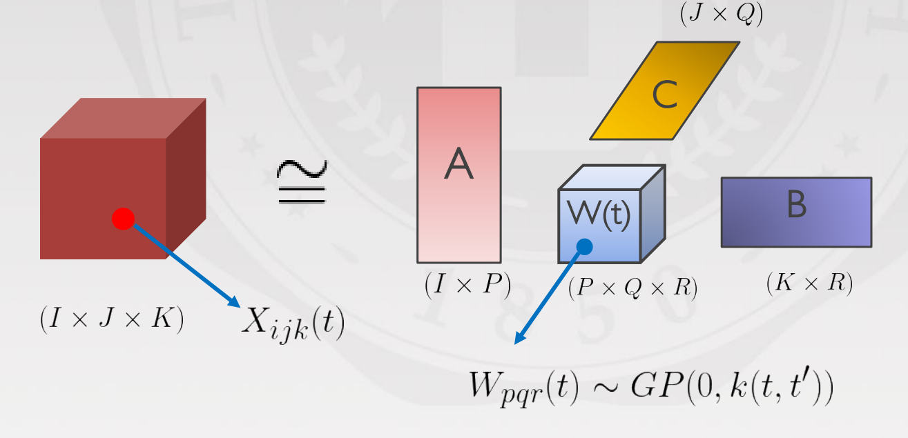
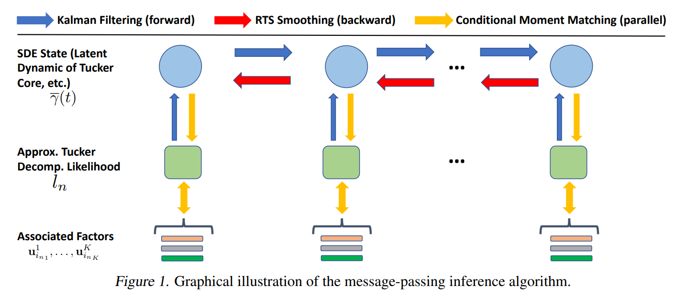

# Bayesian-Continuous-Time-Tucker-Decomposition

by Shikai Fang, Akil Narayan, Robert M. Kirby, Shandian Zhe


This authors' official PyTorch implementation for : [Bayesian Continuous-Time Tucker Decomposition](https://proceedings.mlr.press/v162/fang22b/fang22b.pdf) (ICML2022 Oral paper)

## Methods Overview:

### Dynamic Tucker-core to handle the continuous-time tensor data
As shown in the figures, we assign the tucker core with Temporal-Gaussian Process priors to handle the continuous-time-varing dynamics in the tensor data.


### Efficient Inference: Sequential update of SDE + Parallel update of factors
The Temporal-Gaussian Process with stationaty kernel is equivalent to linear time-invariant stochastic differential equations (LTI-SDE), which we can slove by Kalman-Filter & smoothing sequentialy. We further apply conditional moment-match to update the latent factors. The Inference Algorithm is with linear cost of time-steps. 



## Requirements:
The project is mainly built with pytorch 1.10.1 under python 3. Besides that, make sure to install [tqdm](https://tqdm.github.io/) and [tensorly](http://tensorly.org/stable/index.html) before running the project.

## Instructions:
1. Clone this repository.
2. To play with the code quickly, we offer two notebooks at `code_fang\notebook`(on synthetic & real data)
3. To run the real-world datasets with scripts, run `code_fang\script_BCTT.sh`

Check our paper for more details.

## Citation
Please cite our work if you would like it
```
@inproceedings{fang2022bayesian,
  title={Bayesian Continuous-Time Tucker Decomposition},
  author={Fang, Shikai and Narayan, Akil and Kirby, Robert and Zhe, Shandian},
  booktitle={International Conference on Machine Learning},
  pages={6235--6245},
  year={2022},
  organization={PMLR}
}
```

